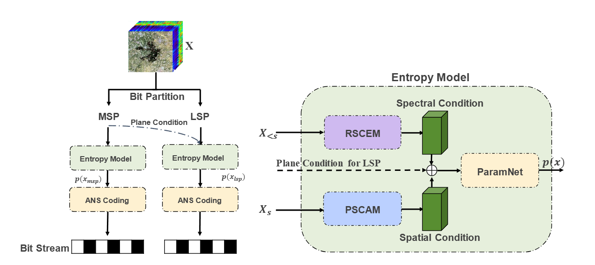

# End-to-End Optimized Lossless Hyperspectral Image Compression with Bit Partition

## Introduction

This repository is the official PyTorch implementation of the paper *"End-to-End Optimized Lossless Hyperspectral Image Compression with Bit Partition"*.




## Installation

This implementation requires Python 3.11 and PyTorch 2.0.1.

1. Install the dependencies
   We recommend using cuda 11.8(at least).

   ```
   conda create -n $YOUR_PY_ENV_NAME python=3.11
   conda activate $YOUR_PY_ENV_NAME

   pip install torch==2.0.1 torchvision==0.15.2 --index-url https://download.pytorch.org/whl/cu118
   pip install -r requirements.txt
   ```
   
2. Compile the arithmetic coder

   Please compile the arithmetic coder using the following commands. The compiled files are located in the directories `src/coder/build`.

   ```
   cd src/coder
   python setup.py install
   ```
   
   We also provide the arithmetic coder for Linux, Python 3.11, specifically `rans.cpython-311-x86_64-linux-gnu.so`.

## Usage

### Dataset

Follow the [HyspecNet-11k](https://git.tu-berlin.de/rsim/hsi-compression) repository to prepare the dataset files.

### Encode
To encode the hyperspectral image, please run the following command.

```
CUDA_VISIBLE_DEVICES=0 python -m script.encode_lhic \
         --config [path-to-config] \
         --param_d [param_d] \
         --msp_ckpt_dir [path-to-msp-ckpt] \
         --lsp_ckpt_dir [path-to-lsp-ckpt] \
         --data [path-to-original-data] \
         --out [path-to-compressed-bitstream]
```
Here is an example command, we take the ENMAP01-____L2A-DT0000004981_20221102T031513Z_004_V010110_20221116T123616Z-Y01430270_X08150942-DATA.npy as input, which serves as a processed HyspecNet-11k testset image.
```
CUDA_VISIBLE_DEVICES=0 python -m script.encode_lhic \
    --config ./ckpt/lhic_bp/config.yml \
    --param_d 8 \
    --msp_ckpt_dir ./ckpt/lhic_bp/msp_ckpt.pth \
    --lsp_ckpt_dir ./ckpt/lhic_bp/lsp_ckpt.pth \
    --data ./dataset/ENMAP01-____L2A-DT0000004981_20221102T031513Z_004_V010110_20221116T123616Z-Y01430270_X08150942-DATA.npy \
    --out ./results/ENMAP01-____L2A-DT0000004981_20221102T031513Z_004_V010110_20221116T123616Z-Y01430270_X08150942-DATA.bin
```

### Decode
To decode from bitstream, please run the following command.

```
CUDA_VISIBLE_DEVICES=0 python -m script.decode_lhic \
         --config [path-to-config] \
         --msp_ckpt_dir [path-to-msp-ckpt] \
         --lsp_ckpt_dir [path-to-lsp-ckpt] \
         --bin  [path-to-compressed-bitstream]\
         --out  [path-to-save-decompressed-image] \
         --data [path-to-original-data]
```
We provide an additional parameter for original hyperspectral image so that we can directly check if the proposed method is lossless. You can also set it to None for pure decompression. Example command for decoding is listed below.

```
CUDA_VISIBLE_DEVICES=0 python -m script.decode_lhic \
         --config ./ckpt/lhic_bp/config.yml \
         --msp_ckpt_dir ./ckpt/lhic_bp/msp_ckpt.pth \
         --lsp_ckpt_dir ./ckpt/lhic_bp/lsp_ckpt.pth \
         --bin  ./results/ENMAP01-____L2A-DT0000004981_20221102T031513Z_004_V010110_20221116T123616Z-Y01430270_X08150942-DATA.bin \
         --out  ./results/decoded_data.npy \
         --data ./dataset/ENMAP01-____L2A-DT0000004981_20221102T031513Z_004_V010110_20221116T123616Z-Y01430270_X08150942-DATA.npy
```


## Pretrained Model
Pretrained models are available [here](src/ckpt).


## Acknowledgement

Part of our code is implemented based on [ArIB-BPS](https://github.com/ZZ022/ArIB-BPS), [LineRWKV](https://github.com/diegovalsesia/linerwkv) and [DLPR](https://github.com/BYchao100/Deep-Lossy-Plus-Residual-Coding). Thanks for these excellent jobs!